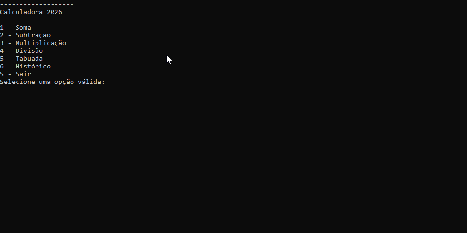

# Calculadora 2026



## Introdução

Uma calculadora de console simples mas poderosa que permita relizar as quatro operações matemáticas, além da visualição do histórico de operações e tabuada.

## Funcionalidades

- **Operações básicas:** Realize somas, subtrações, multiplicações e divisões com facilidade.
- **Tratamento de Divisão por Zero:** A calculadora é capaz de validar erros de divisão por zero.
- **Tabuada:** A calculadora é capaz de gerar tabuada de um número informado.
- **Histórico de Operações:** A calculadora é capaz de armazenar um histórico das operações anteriores.

## Como utilizar o programa

1. Clone o repositório ou baixe o código comprimido em .zip.
2. Abra o emulador de terminal e navegue até a pasta raiz.
3. Utilize o comando abaixo para restaurar as dependências do projeto.

    ```
    dotnet restore
    ```

4. Em seguida compile e execute o projeto com o comando:

```
dotnet run -- project Calculadora.ConsoleApp
```

## Requisitos

- .NET SDK 10.0